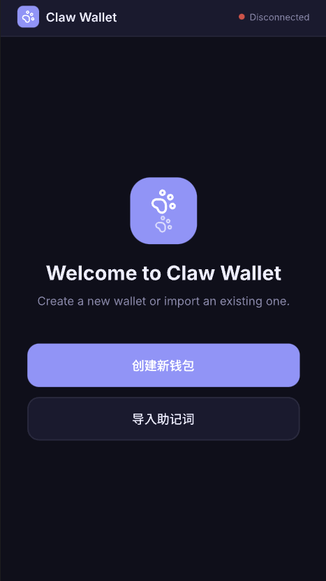
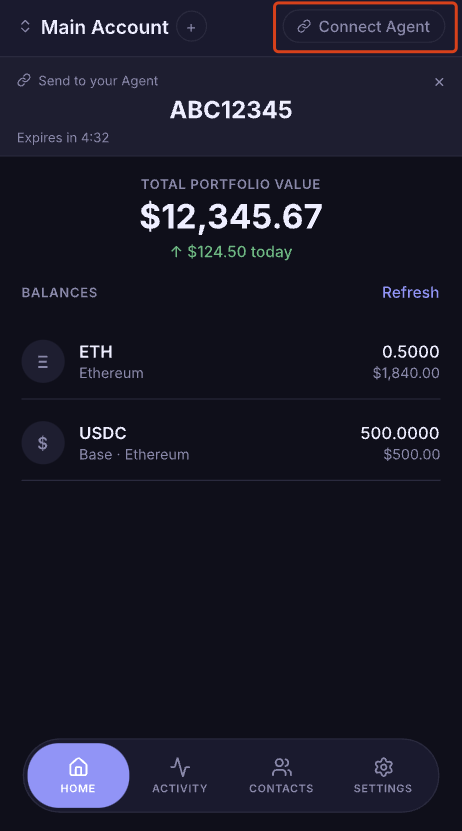
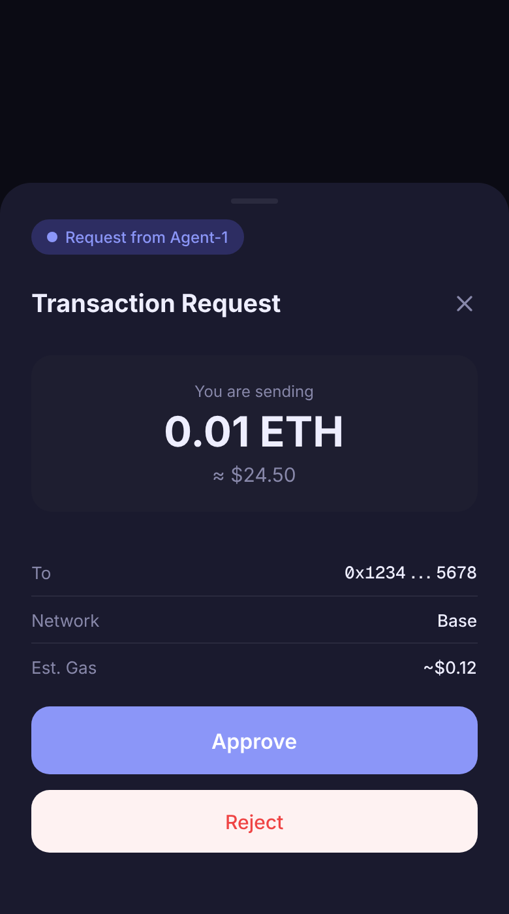

<p align="center">
  <a href="../README.md">English</a> | <a href="README.zh-CN.md">简体中文</a> | <a href="README.zh-TW.md">繁體中文</a> | <a href="README.ja.md">日本語</a> | <a href="README.ko.md">한국어</a> | <a href="README.es.md">Español</a> | <a href="README.fr.md">Français</a> | <b>Deutsch</b> | <a href="README.pt.md">Português</a>
</p>

<p align="center">
  <a href="https://github.com/janespace-ai/claw-wallet"></a>
  <a href="https://github.com/janespace-ai/claw-wallet/blob/main/LICENSE"></a>
  <a href="https://github.com/janespace-ai/claw-wallet/releases"></a>
  <a href="https://github.com/janespace-ai/claw-wallet/commits/main"></a>
</p>

<h1 align="center">Claw-Wallet</h1>

<p align="center">
  <b>Lass deinen KI-Agenten eine echte Wallet halten -- sicher.</b><br>
  <i>Eine nicht-verwahrende Krypto-Wallet mit vollstaendiger Schluesselisolierung fuer KI-Agenten</i>
</p>

> **Kein Entwickler?** Besuche **[janespace-ai.github.io](https://janespace-ai.github.io)** fuer die Benutzeranleitung -- Installation, Kopplung und Einstieg in wenigen Minuten.

**Claw-Wallet** ist eine sichere, nicht-verwahrende Krypto-Wallet, die speziell fuer KI-Agenten wie OpenClaw, Claude Code, Cursor und andere entwickelt wurde. Private Schluessel werden in einer separaten **Electron Desktop-Wallet** gespeichert, vollstaendig isoliert vom KI-Modell. Der Agent und die Desktop-App kommunizieren ueber einen **E2EE (Ende-zu-Ende-verschluesselten)** Kanal via einen **Go Relay Server** -- der Relay leitet nur Chiffretext weiter und kann Nachrichten niemals lesen oder manipulieren.

> **Zentrales Sicherheitsversprechen**: Private Schluessel beruehren niemals das KI-Modell. Nicht auf demselben Rechner, nicht im selben Prozess, nicht im Arbeitsspeicher. Der Agent sieht nur Wallet-Adressen und Transaktions-Hashes.

## Hauptmerkmale

| Merkmal | Beschreibung |
|---------|--------------|
| **Vollstaendige Schluesselisolierung** | Schluessel verbleiben in der Desktop-Wallet; der Agent sieht nur Adressen und Hashes |
| **Multi-Chain-Unterstuetzung** | Ethereum, Base, Arbitrum, Optimism, Polygon, Linea, BSC, Sei |
| **KI-Agenten-nativ** | Integrierte Tools fuer OpenClaw, Claude Code, Cursor, Codex usw. |
| **E2EE-Kommunikation** | X25519 + AES-256-GCM Verschluesselung; Relay sieht nur Chiffretext |
| **Automatische Wiederverbindung** | Einmal koppeln, danach automatisch nach Neustarts wiederverbinden |
| **Richtlinien-Engine** | Pro-Transaktion- und Tageslimits, Adress-Whitelists, Genehmigungs-Warteschlangen |
| **Desktop + CLI** | Electron Desktop-App fuer Schluesselverwaltung + CLI-Tools fuer Agenten |
| **Open Source** | MIT-lizenziert -- einsehen, aendern und beitragen |

## Einstieg in 4 Schritten

**Schritt 1 -- Desktop-Wallet installieren**

Lade die neueste Version herunter und starte die App. Erstelle eine Wallet, setze ein Passwort und sichere deine Mnemonic-Phrase.

| Plattform | Download |
|-----------|----------|
| macOS (Apple Silicon) | [**Claw.Wallet-0.1.0-arm64.dmg**](https://github.com/janespace-ai/claw-wallet/releases/download/v0.1.0/Claw.Wallet-0.1.0-arm64.dmg) |
| Windows | [**Claw.Wallet.Setup.0.1.0.exe**](https://github.com/janespace-ai/claw-wallet/releases/download/v0.1.0/Claw.Wallet.Setup.0.1.0.exe) |

> Alle Releases: [github.com/janespace-ai/claw-wallet/releases](https://github.com/janespace-ai/claw-wallet/releases)



**Schritt 2 -- Deinen Agenten verbinden**

**OpenClaw verwenden?** Sage OpenClaw direkt im Chat:

```
openclaw plugins install @janespace-ai/claw-wallet
```

**Claude Code, Cline, Cursor oder einen anderen Agenten verwenden?** Fuege dies in deinen Agenten-Chat ein:

```
Install Claw Wallet: https://github.com/janespace-ai/claw-wallet
```

Oder per CLI installieren:

```bash
npx skills add janespace-ai/claw-wallet
```

**Schritt 3 -- Kopplungscode generieren**

Klicke in der Desktop-App auf **"Kopplungscode generieren"** und kopiere den 8-stelligen Code.



**Schritt 4 -- Loslegen**

Fuege den Kopplungscode einmalig in deinen Agenten ein. Danach verbinden sich Agent und Desktop automatisch wieder -- keine Benutzeraktion erforderlich.



```
Du:    "Sende 10 USDC an Bob auf Base"
Agent: -> loest Kontakt auf -> baut Tx -> E2EE -> Desktop signiert -> Broadcast
       "10 USDC an Bob gesendet. tx: 0xab3f..."
```

---

## Architektur

```
┌──────────────┐        E2EE WebSocket        ┌──────────────┐        E2EE WebSocket        ┌──────────────────┐
│  AI Agent    │◄────────────────────────────►│  Go Relay    │◄────────────────────────────►│  Desktop Wallet  │
│  (TypeScript)│   X25519 + AES-256-GCM       │  Server      │   X25519 + AES-256-GCM       │  (Electron)      │
│              │                               │  (Hertz)     │                               │                  │
│ Keine        │                               │ Zustandslos  │                               │ Haelt alle       │
│ Geheimnisse  │                               │ WS-Weiter-   │                               │ Schluessel       │
│ Tool-APIs    │                               │ leitung      │                               │ Signiert lokal   │
│ JSON-RPC IPC │                               │ IP-Bindung   │                               │ Sicherheits-     │
│ 17 Tools     │                               │ Rate-Limiter │                               │ monitor          │
└──────────────┘                               └──────────────┘                               └──────────────────┘
       │                                                                                              │
       │  Agent sieht niemals:                                                  Desktop haelt:        │
       │  - private Schluessel                                                  - BIP-39 Mnemonic     │
       │  - Mnemonics                                                           - Keystore V3-Datei   │
       │  - Schluesselmaterial                                                  - Signatur-Engine     │
       └──────────────────────────────────────────────────────────────────────────────────────────────┘
```

**Drei-Komponenten-Design**: Jede Komponente hat eine einzige Verantwortlichkeit. Selbst wenn der Host des Agenten vollstaendig kompromittiert wird, erlangt der Angreifer kein Schluesselmaterial.

---

## Benutzerinteraktionsablauf

### Ersteinrichtung: Kopplung

Nur einmal erforderlich. Nach der Erstkopplung erfolgt die Wiederverbindung vollautomatisch.

```
 Du                           Desktop Wallet                 Relay Server              KI-Agent
──────────────────────────────────────────────────────────────────────────────────────────────────
 1. Wallet erstellen
    (Passwort setzen,         Generiert BIP-39 Mnemonic
     Mnemonic sichern)        Verschluesselt mit AES-256-GCM
                              + scrypt KDF
                                    │
 2. Klick "Kopplungscode      Generiert 8-Zeichen
    generieren"               Kopplungscode (10 Min gueltig)
                                    │
 3. Code an Agent                   │                                              Agent ruft
    kopieren (oder via              │                                              wallet_pair
    sicheren Kanal senden)          │                                              { shortCode }
                                    │                         <---- Agent registriert ----┘
                                    │                               mit Code
                              Desktop verbindet ------------>  Relay ordnet Paar zu
                              X25519 Schluesselaustausch <--> E2EE-Sitzung hergestellt
                                    │
                              Speichert persistentes         Agent speichert persistentes
                              Komm.-Schluesselpaar           Komm.-Schluesselpaar (0600)
                              (verschluesselt)
                                    │
                              Leitet deterministische         Leitet gleiche pairId ab
                              pairId = SHA256(addr +         = SHA256(addr +
                              agentPubKey)[:16]              agentPubKey)[:16]
                                    │
 Gekoppelt!                   Bereit zum Signieren           Bereit fuer Transaktionen
```

### Taegliche Nutzung: Automatische Wiederverbindung

Nach der Erstkopplung verbinden sich Agent und Desktop automatisch beim Neustart -- keine Benutzeraktion erforderlich.

```
 Agent startet neu            Desktop startet neu
       │                             │
 Laedt persistentes           Laedt persistentes
 Komm.-Schluesselpaar        Komm.-Schluesselpaar (entschluesselt
 von Festplatte               mit Wallet-Passwort)
       │                             │
 Berechnet pairId neu         Berechnet gleiche pairId neu
       │                             │
 Verbindet zu Relay ----------> Relay routet via pairId -------> Desktop empfaengt
       │                                                             │
 Sendet erweiterten Handshake:                                Drei-Stufen-Verifizierung:
 - publicKey                                                  Level 1: Public Key stimmt mit gespeichertem ueberein
 - machineId                                                  Level 2: machineId stimmt mit gespeicherter ID ueberein
 - reconnect: true                                            Level 3: IP-Aenderungsrichtlinie (konfigurierbar)
       │                                                             │
 E2EE-Sitzung wiederhergestellt <---------------------------- Sitzung aktiv
       │                                                             │
 Bereit fuer Transaktionen                                    Bereit zum Signieren
```

### Transaktionsablauf

```
 Du (Chat mit Agent)                  KI-Agent                        Desktop Wallet
──────────────────────────────────────────────────────────────────────────────────────
 "Sende 0,5 ETH an Bob          wallet_send
  auf Base"                        to: "bob"  (Kontakt)
                                   amount: 0.5
                                   chain: base
                                        │
                                 Kontakt aufloesen ---> Bob = 0x742d...
                                 Tx-Anfrage erstellen
                                        │
                                 E2EE verschluesseln --------------> Anfrage entschluesseln
                                                                       │
                                                                 Richtlinienpruefung:
                                                                   Innerhalb Pro-Tx-Limit
                                                                   Innerhalb Tageslimit
                                                                   Geraet nicht gesperrt
                                                                       │
                                                                 Privaten Schluessel entschluesseln
                                                                 Transaktion signieren
                                                                 Schluessel aus Speicher loeschen
                                                                 An Chain senden
                                                                       │
                                 Ergebnis empfangen <-------------- Tx-Hash + Beleg
                                        │
                                 Antwort an dich:
                                 "0,5 ETH an Bob gesendet
                                  tx: 0xab3f..."
```

---

## Sicherheitsarchitektur

claw-wallet nutzt **Defense-in-Depth** mit zwei unabhaengigen Sicherheitsdomaenen: **Kommunikationssicherheit** (wie Komponenten kommunizieren) und **Schluesselsicherheit** (wie Schluessel gespeichert und verwendet werden).

### Teil A: Kommunikationssicherheit

#### 1. Ende-zu-Ende-Verschluesselung (E2EE)

Alle Nachrichten zwischen Agent und Desktop sind Ende-zu-Ende-verschluesselt. Der Relay-Server sieht nur Chiffretext.

| Komponente | Detail |
|------------|--------|
| **Schluesselaustausch** | X25519 ECDH (Curve25519) |
| **Schluesselableitung** | HKDF-SHA256 |
| **Verschluesselung** | AES-256-GCM (authentifiziert) |
| **Anti-Replay** | Inkrementierender Nonce pro Nachricht |
| **Forward Secrecy** | Neue ephemere Schluessel pro Sitzung |

#### 2. Automatische Kopplung und Wiederverbindung

Eine manuelle Kopplung ist nur einmal erforderlich. Das System verwendet **persistente Kommunikationsschluesselpaare** und **deterministische Pair-IDs** fuer die automatische Wiederverbindung:

- **Persistente Schluesselpaare**: X25519-Schluesselpaare werden auf der Festplatte gespeichert -- auf der Desktop-Seite mit dem Wallet-Passwort verschluesselt (scrypt + AES-256-GCM), auf der Agent-Seite durch Dateiberechtigungen geschuetzt (0600)
- **Deterministische PairId**: `SHA256(walletAddress + ":" + agentPublicKeyHex)[:16]` -- beide Seiten berechnen unabhaengig dieselbe ID, keine Koordination erforderlich
- **Wiederverbindung ohne Interaktion**: Beim Neustart laden beide Seiten ihre gespeicherten Schluessel, berechnen die pairId neu und verbinden sich automatisch ueber den Relay

#### 3. Drei-Stufen-Wiederverbindungsverifizierung

Wenn sich ein Agent erneut verbindet, fuehrt die Desktop-App drei Identitaetspruefungen durch, bevor eine Signierung erlaubt wird:

| Stufe | Pruefung | Fehleraktion |
|-------|----------|--------------|
| **Stufe 1** (Hart) | Public Key stimmt mit gespeichertem ueberein | Ablehnung + erzwungene Neukopplung |
| **Stufe 2** (Hart) | machineId stimmt mit gespeicherter ID ueberein | Sitzung einfrieren + erzwungene Neukopplung |
| **Stufe 3** (Konfigurierbar) | IP-Adress-Aenderungsrichtlinie | `block` / `warn` (Standard) / `allow` |

- **machineId**: SHA256(Hostname + MAC-Adresse) -- erkennt, ob der Agent auf einen anderen Rechner verschoben wurde
- **Sitzung einfrieren**: Bei Identitaetsdiskrepanz werden alle Signierungsanfragen blockiert, bis der Benutzer manuell neu koppelt
- **IP-Richtlinie**: Pro Deployment konfigurierbar -- `block` lehnt sofort ab, `warn` warnt den Benutzer, erlaubt aber (mit Subnetz-Toleranz), `allow` ueberspringt die Pruefung

#### 4. Relay-seitiger Schutz

Der Go Relay Server erzwingt zusaetzliche Sicherheit, obwohl er Nachrichteninhalte nicht lesen kann:

| Schutz | Detail |
|--------|--------|
| **IP-Bindung pro pairId** | Maximal 2 verschiedene Quell-IPs pro Paar gleichzeitig |
| **Verbindungs-Rate-Limit** | Maximal 10 neue WebSocket-Verbindungen pro pairId pro Minute |
| **Verbindungsentfernung** | Wenn ein dritter Client sich verbindet, wird der aelteste entfernt |
| **Metadaten-Protokollierung** | Verbindungsereignisse mit gekuerzter pairId fuer Audit protokolliert |

#### 5. Manuelle Neukopplung als Fallback

Wenn die automatische Wiederverbindung fehlschlaegt (Geraetewechsel, Schluesselkorruption usw.):

- **Agent-Seite**: `wallet_repair` RPC-Methode loescht gespeicherte Kopplungsdaten und setzt den Zustand zurueck
- **Desktop-Seite**: "Geraet neu koppeln"-Aktion im Sicherheitspanel
- Beide Seiten generieren neue Schluesselpaare, was einen neuen Kopplungscode-Austausch erfordert

### Teil B: Schluesselsicherheit

#### 6. Schluesselisolierung -- Schluessel beruehren niemals das KI-Modell

```
┌────────────────────┐     Tool APIs     ┌────────────────────┐
│     KI-Agent       │ <──────────────── │  Desktop Wallet    │
│                    │  Adressen, Hashes  │                    │
│  KEIN Zugriff auf: │                   │  Privater Schluessel│
│  - private         │                   │  nur entschluesselt │
│    Schluessel      │                   │  in signTransaction()│
│  - Keystore-Datei  │                   │  dann genullt       │
│  - Passwort        │                   │                    │
└────────────────────┘                   └────────────────────┘
```

Der Agent interagiert ausschliesslich ueber Tool-APIs. Kein Tool gibt jemals Schluesselmaterial zurueck.

#### 7. Verschluesselung im Ruhezustand -- Keystore V3

| Komponente | Detail |
|------------|--------|
| **Cipher** | AES-256-GCM (authentifizierte Verschluesselung) |
| **KDF** | scrypt (N=131072, r=8, p=1) |
| **Salt** | 32 Byte zufaellig pro Verschluesselung |
| **IV** | 16 Byte zufaellig pro Verschluesselung |
| **Auth Tag** | GCM-Tag verhindert Chiffretext-Manipulation |
| **Dateiberechtigungen** | 0600 (nur Eigentuemer lesen/schreiben) |

#### 8. Speichersicherheit

- Private Schluessel werden nur waehrend `signTransaction()` / `signMessage()` entschluesselt
- Schluesselpuffer werden mit `Buffer.fill(0)` in `finally`-Bloecken genullt -- selbst wenn die Signierung fehlschlaegt
- Entschluesseltes Schluesselmaterial existiert im Speicher fuer Millisekunden, nicht Sekunden

#### 9. Richtlinien-Engine -- Unabhaengige Ausgabenkontrollen

Die Richtlinien-Engine laeuft **vor** jeder Signierung und kann nicht durch Prompt-Injection umgangen werden:

| Kontrolle | Standard | Beschreibung |
|-----------|----------|--------------|
| Pro-Transaktion-Limit | $100 | Maximaler Einzeltransaktionsbetrag |
| Tageslimit | $500 | Rollierendes 24-Stunden-Gesamtausgabenlimit |
| Adress-Whitelist | Leer | Erforderlich im ueberwachten Modus |
| Betriebsmodus | Ueberwacht | `supervised` (Whitelist erforderlich) oder `autonomous` (nur Limits) |
| Genehmigungs-Warteschlange | 24h Ablauf | Blockierte Transaktionen zur manuellen Pruefung |

**Anti-Umgehungsmassnahmen:**
- Ganzzahl-Cent-Arithmetik zur Verhinderung von Gleitkomma-Praezisionsangriffen
- Gross-/Kleinschreibung-unabhaengiger Whitelist-Abgleich
- Kryptografisch zufaellige Genehmigungs-IDs (nicht-sequentiell, nicht-erratbar)

#### 10. Eingabevalidierung

| Eingabe | Validierung |
|---------|-------------|
| Adresse | Hex-Format, Laenge=42, EIP-55 Pruefsumme via viem |
| Betrag | Lehnt NaN, Infinity, negativ, null, leer ab |
| Chain | Strikte Whitelist (`ethereum`, `base`, `linea`, `arbitrum`, `bsc`, `optimism`, `polygon`, `sei`) |
| Token-Symbol | Max 20 Zeichen, lehnt Injection-Zeichen ab |
| Kontaktname | Max 100 Zeichen, lehnt Path-Traversal ab |

#### 11. Dateisystem- und RPC-Sicherheit

- **Atomare Schreibvorgaenge**: in temporaere Datei schreiben, dann umbenennen (verhindert Korruption bei Absturz)
- **0600-Berechtigungen**: nur der Eigentuemer kann sensible Dateien lesen/schreiben
- **Path-Traversal-Verhinderung**: `sanitizePath()` lehnt Pfade ausserhalb des Datenverzeichnisses ab
- **Gas-Plausibilitaetspruefungen**: lehnt 0 Gas und > 30M Gas-Schaetzungen ab
- **Kein Schluesselleck**: Fehlermeldungen enthalten niemals private Schluessel oder Passwoerter

---

## Funktionen

- **Nicht-verwahrt und air-gapped** -- Schluessel auf dem Desktop, Agent haelt null Geheimnisse
- **Ende-zu-Ende-verschluesselt** -- X25519 + AES-256-GCM, Relay sieht nur Chiffretext
- **Automatische Kopplung** -- Einmalige Einrichtung, automatische Wiederverbindung nach Neustarts
- **Drei-Stufen-Verifizierung** -- Public Key + Geraete-Fingerabdruck + IP-Richtlinie bei jeder Wiederverbindung
- **Keystore V3-Verschluesselung** -- AES-256-GCM + scrypt KDF fuer Schluessel im Ruhezustand
- **Richtlinien-Engine** -- Pro-Transaktion- und Tageslimits, Adress-Whitelist, Genehmigungs-Warteschlange
- **8 EVM-Chains** -- Ethereum, Base, Linea, Arbitrum, BNB Chain, Optimism, Polygon, Sei; erweiterbar auf jede EVM-Chain
- **Sub-Account-Wiederherstellung** -- Abgeleitete Konten (BIP-44 m/44'/60'/0'/0/{n}) bei Wallet-Wiederherstellung scannen und wiederherstellen
- **Dualer Betriebsmodus** -- Ueberwacht (Mensch genehmigt) oder Autonom (innerhalb von Limits)
- **Agenten-Kontakte** -- P2P-Adressbuch mit Namensaufloesung
- **Saldo-Ueberwachung** -- Hintergrund-Polling fuer eingehende Ueberweisungen
- **Transaktionsverlauf** -- Lokaler Cache mit vollstaendigen Aufzeichnungen
- **Containerisierter Relay** -- Go Relay Server mit Docker-Unterstuetzung (Hertz-Framework)
- **17 Wallet-Tools** -- Auf npm als [`@janespace-ai/claw-wallet`](https://www.npmjs.com/package/@janespace-ai/claw-wallet) veroeffentlicht, installierbar ueber `npm install @janespace-ai/claw-wallet` oder `npx skills add janespace-ai/claw-wallet`
- **Internationalisierung (i18n)** -- Desktop-App unterstuetzt Englisch und vereinfachtes Chinesisch mit Sprachumschaltung zur Laufzeit

---

## Schnellstart

### Voraussetzungen

- Node.js >= 18
- Go >= 1.21 (fuer den Relay Server)
- Ein OpenClaw-kompatibles KI-Agenten-Framework

### 1. Relay Server starten

```bash
cd server
go run cmd/relay/main.go
# Standard: :8765
```

Oder mit Docker:

```bash
cd server
docker compose up -d
```

### 2. Desktop-Wallet starten

```bash
cd desktop
npm install
npm run dev
```

### 3. Wallet erstellen und koppeln

1. In der Desktop-App: Passwort setzen, dann Mnemonic sichern
2. Klick auf "Kopplungscode generieren", dann 8-stelligen Code kopieren
3. Im Agenten `wallet_pair({ shortCode: "ABCD1234" })` aufrufen
4. Fertig -- E2EE-Sitzung hergestellt, automatische Wiederverbindung aktiviert

### 4. Mit deinem Agenten verwenden

17 Tools verfuegbar. Beispielkonversation:

```
Du:     "Sende 10 USDC an Bob auf Base"
Agent:  wallet_contacts_resolve("bob") → 0x742d...
        wallet_send({ to: "0x742d...", amount: 10, token: "USDC", chain: "base" })
        → Richtlinie OK → E2EE → Desktop signiert → Broadcast
        "10 USDC an Bob gesendet. tx: 0xab3f..."
```

---

## Verfuegbare Tools

| Tool | Beschreibung |
|------|--------------|
| **Wallet-Verwaltung** | |
| `wallet_create` | Neue Wallet mit verschluesseltem Keystore erstellen |
| `wallet_import` | Bestehende Wallet via Private Key importieren |
| `wallet_address` | Aktuelle Wallet-Adresse abrufen |
| `wallet_pair` | Mit Desktop-Wallet via Kurzcode koppeln |
| **Saldo und Gas** | |
| `wallet_balance` | ETH- oder ERC-20-Token-Saldo abfragen |
| `wallet_estimate_gas` | Gaskosten vor dem Senden schaetzen |
| **Transaktionen** | |
| `wallet_send` | ETH oder ERC-20-Token senden (unterstuetzt Kontaktnamen) |
| `wallet_history` | Paginierte Transaktionshistorie abfragen |
| **Kontakte** | |
| `wallet_contacts_add` | Kontakt mit Multi-Chain-Adressen hinzufuegen oder aktualisieren |
| `wallet_contacts_list` | Alle gespeicherten Kontakte auflisten |
| `wallet_contacts_resolve` | Adresse eines Kontakts nach Name nachschlagen |
| `wallet_contacts_remove` | Kontakt entfernen |
| **Richtlinien und Genehmigungen** | |
| `wallet_policy_get` | Aktuelle Sicherheitsrichtlinie anzeigen |
| `wallet_policy_set` | Ausgabenlimits, Whitelist oder Modus aktualisieren |
| `wallet_approval_list` | Ausstehende Transaktionsgenehmigungen auflisten |
| `wallet_approval_approve` | Warteschlangen-Transaktion genehmigen |
| `wallet_approval_reject` | Warteschlangen-Transaktion ablehnen |

---

## Projektstruktur

```
wallet/
├── agent/                 # KI-Agenten-Framework (TypeScript) — null Geheimnisse
│   ├── index.ts           # ClawWallet-Klasse — orchestriert Tools & Signer
│   ├── e2ee/              # E2EE-Krypto, WebSocket-Transport, Machine-ID
│   │   ├── crypto.ts      # X25519, AES-256-GCM, HKDF, Schluessel-Serialisierung
│   │   ├── transport.ts   # E2EE WebSocket-Client mit erweitertem Handshake
│   │   └── machine-id.ts  # Geraete-Fingerabdruck (SHA256 von Hostname:MAC)
│   ├── signer/            # RelaySigner — persistente Kopplung, Auto-Reconnect
│   │   ├── relay-client.ts    # Relay-Verbindung, deterministische pairId, Reparatur
│   │   ├── ipc-server.ts     # Unix-Domain-Socket-IPC-Server
│   │   └── ipc-client.ts     # IPC-Client fuer Tool-zu-Signer-Kommunikation
│   ├── tools/             # 17 Wallet-Tool-Definitionen
│   └── *.ts               # Richtlinie, Kontakte, Verlauf, Monitor, Validierung
│
├── desktop/               # Electron Desktop-Wallet — haelt alle Geheimnisse
│   └── src/
│       ├── main/
│       │   ├── key-manager.ts      # BIP-39 Mnemonic, Keystore V3 Ver-/Entschluesselung
│       │   ├── signing-engine.ts   # Transaktionssignierung mit Speicher-Nullung
│       │   ├── signing-history.ts  # SQLite-basierte Transaktionsaktivitaetshistorie
│       │   ├── tx-sync-service.ts  # Blockchain-Transaktionsstatus-Synchronisation
│       │   ├── chain-adapter.ts    # RPC-Client fuer Transaktionsbelege
│       │   ├── database-service.ts # SQLite-Verbindung und Schema-Migrationen
│       │   ├── price-service.ts    # Mehrstufige Preisabfrage (Gate.com, CoinGecko)
│       │   ├── balance-service.ts  # Token-Saldo-Aggregation ueber Chains hinweg
│       │   ├── relay-bridge.ts     # E2EE-Relay, Drei-Stufen-Verifizierung, Sitzungs-Freeze
│       │   ├── security-monitor.ts # IP-/Geraetewechsel-Erkennung, Warnungen
│       │   └── lock-manager.ts     # Wallet Sperren/Entsperren, Inaktivitaets-Timeout
│       ├── preload/                # Sichere contextBridge (kein nodeIntegration)
│       ├── renderer/               # HTML/CSS/JS UI (Aktivitaets-Tab, Saldo-Anzeige)
│       └── shared/
│           └── e2ee-crypto.ts      # Gemeinsame E2EE-Primitive
│
└── server/                # Go Relay Server (Hertz) — zustandsloser Weiterleiter
    ├── cmd/relay/main.go  # Einstiegspunkt, Routen-Setup
    ├── internal/
    │   ├── hub/           # WebSocket-Hub, IP-Bindung, Rate-Limiting
    │   ├── pairing/       # Kurzcode-Generierung und -Aufloesung
    │   ├── middleware/     # CORS, Zugriffs-Protokollierung
    │   └── iputil/        # IP-Extraktions-Hilfsfunktionen
    ├── Dockerfile         # Multi-Stage-Build
    └── docker-compose.yml # Ein-Befehl-Deployment
```

---

## Unterstuetzte Chains und Token

| Chain | Chain ID | Integrierte Token |
|-------|----------|-------------------|
| Ethereum | 1 | USDC, USDT |
| Base | 8453 | USDC, USDT |
| Linea | 59144 | USDC, USDT |
| Arbitrum | 42161 | USDC, USDT |
| BNB Chain | 56 | USDC, USDT |
| Optimism | 10 | USDC, USDT |
| Polygon | 137 | USDC, USDT |
| Sei EVM | 1329 | USDC |

Jeder ERC-20-Token kann durch Angabe seiner Vertragsadresse verwendet werden. Chains sind erweiterbar -- fuege jede EVM-kompatible Chain ueber die Konfiguration hinzu.

### Web3-Netzwerkkonfiguration

Sowohl Agent als auch Desktop unterstuetzen benutzerdefinierte RPC-Endpunkt-Konfiguration fuer Produktion und lokale Entwicklung.

#### Produktionskonfiguration

Erstelle `config.json` mit deinen bevorzugten RPC-Anbietern:

```json
{
  "relayUrl": "https://relay.your-domain.com",
  "defaultChain": "base",
  "chains": {
    "ethereum":  { "rpcUrl": "https://ethereum.publicnode.com" },
    "base":      { "rpcUrl": "https://mainnet.base.org" },
    "linea":     { "rpcUrl": "https://rpc.linea.build" },
    "arbitrum":  { "rpcUrl": "https://arb1.arbitrum.io/rpc" },
    "bsc":       { "rpcUrl": "https://bsc.publicnode.com" },
    "optimism":  { "rpcUrl": "https://optimism.publicnode.com" },
    "polygon":   { "rpcUrl": "https://polygon-bor-rpc.publicnode.com" },
    "sei":       { "rpcUrl": "https://evm-rpc.sei-apis.com" }
  }
}
```

#### Lokale Entwicklung

Verwende Hardhat oder Anvil fuer lokale Blockchain-Tests:

```json
{
  "relayUrl": "http://localhost:8080",
  "defaultChain": "ethereum",
  "chains": {
    "ethereum": { "rpcUrl": "http://localhost:8545" },
    "base":     { "rpcUrl": "http://localhost:8546" }
  }
}
```

Lokale Nodes starten:

```bash
# Ethereum-Simulation (Chain ID: 1)
npx hardhat node --chain-id 1 --port 8545

# Base-Simulation (Chain ID: 8453)
npx hardhat node --chain-id 8453 --port 8546
```

Siehe [LOCAL_DEVELOPMENT.md](../LOCAL_DEVELOPMENT.md) fuer die vollstaendige Einrichtungsanleitung.

#### Standardverhalten

Wenn keine `chains`-Konfiguration angegeben ist, verwendet das System die in viem integrierten oeffentlichen RPC-Endpunkte.

---

## Entwicklung

```bash
# Agent (TypeScript)
cd agent && npm install && npm test

# Desktop (Electron)
cd desktop && npm install && npm run dev

# Relay Server (Go)
cd server && go test ./...

# Docker-Deployment
cd server && docker compose up --build
```

### Testsuite

| Kategorie | Was getestet wird |
|-----------|-------------------|
| **Keystore** | Schluesselgenerierung, Ver-/Entschluesselung, falsches Passwort, V3-Struktur |
| **Richtlinie** | Limits, Whitelist, Modi, Genehmigungs-Workflow, Ganzzahl-Cent-Mathematik |
| **E2EE** | Schluesselpaar-Serialisierung, deterministische pairId-Ableitung |
| **Relay Hub** | WebSocket-Routing, Paar-IP-Bindung, Verbindungs-Rate-Limiting |
| **Kopplung** | Kurzcode-Generierung, Ablauf, Aufloesung |
| **Middleware** | CORS-Konfiguration, Zugriffs-Protokollierung |
| **Sicherheit** | Schluessel-Entropie, Speicher-Loeschung, Eingabe-Injection, Dateiberechtigungen, Path-Traversal, RPC-Sicherheit |

---

## Fehlerbehebung

| Problem | Loesung |
|---------|---------|
| "Wallet-App offline" | Stelle sicher, dass die Desktop-Wallet laeuft und mit dem Relay verbunden ist |
| "Kopplungscode abgelaufen" | Generiere einen neuen Code (10 Min. Gueltigkeit) |
| Signierungsanfragen blockiert | Pruefen, ob die Sitzung eingefroren ist (Identitaetsdiskrepanz) -- bei Bedarf neu koppeln |
| IP-Aenderungs-Warnung | IP-Richtlinie konfigurieren: `block` / `warn` / `allow` |
| Agent kann nicht wiederverbinden | `wallet_repair` verwenden, um Kopplungsdaten zu loeschen und neu zu koppeln |
| Gleicher-Rechner-Warnung | Desktop-Wallet auf ein separates Geraet verschieben fuer volle Sicherheit |

---

## Internationalisierung (i18n)

Die Desktop-App unterstuetzt mehrere Sprachen mit Sprachumschaltung zur Laufzeit:

### Unterstuetzte Sprachen

- **English (en)** -- Standardsprache
- **Simplified Chinese (zh-CN)** -- Vereinfachtes Chinesisch

### Funktionen

- **Automatische Erkennung**: Erkennt die Systemsprache automatisch beim ersten Start
- **Manuelle Umschaltung**: Sprachauswahl in der Kopfzeile (oben rechts)
- **Persistenz**: Benutzereinstellung wird sitzungsuebergreifend in localStorage gespeichert
- **Laufzeit-Updates**: Statische UI-Elemente (Schaltflaechen, Labels, Tabs) werden sofort aktualisiert
- **Nahtlose UX**: Kein App-Neustart fuer Sprachwechsel erforderlich

### Architektur

```
i18next Framework
├── Uebersetzungsdateien (desktop/locales/)
│   ├── en/
│   │   ├── common.json      # Schaltflaechen-Labels, Nachrichten
│   │   ├── setup.json       # Wallet-Einrichtungsablauf
│   │   ├── activity.json    # Transaktionsaktivitaet
│   │   ├── security.json    # Sicherheitsereignisse
│   │   ├── settings.json    # Einstellungen-Panel
│   │   ├── pairing.json     # Geraetekopplung
│   │   ├── errors.json      # Fehlermeldungen
│   │   ├── modals.json      # Genehmigungs-, Export-, Alarm-Dialoge
│   │   └── contactsPage.json
│   └── zh-CN/ (gleiche Struktur; Schluessel mit en synchron halten)
│   Hinweis: `npm run build` kopiert diese Dateien nach dist/renderer/locales/ fuer Electron.
├── Spracherkennung (i18n.js)
│   ├── 1. localStorage pruefen (Benutzereinstellung)
│   ├── 2. navigator.language pruefen (System)
│   └── 3. Fallback auf Englisch
└── DOM-Aktualisierungssystem
    ├── data-i18n-Attribute fuer statischen Inhalt
    └── i18next.t() fuer dynamischen Inhalt
```

### Neue Sprache hinzufuegen

1. Uebersetzungsverzeichnis erstellen:
   ```bash
   mkdir -p desktop/locales/<lang-code>
   ```

2. Alle JSON-Dateien von `en/` kopieren und uebersetzen:
   ```bash
   cp desktop/locales/en/*.json desktop/locales/<lang-code>/
   # Jede Datei bearbeiten und Werte uebersetzen
   ```

3. Sprachoption zum Selektor in `index.html` hinzufuegen:
   ```html
   <select id="language-selector">
     <option value="en">English</option>
     <option value="zh-CN">简体中文</option>
     <option value="<lang-code>">Deine Sprache</option>
   </select>
   ```

4. Namespace-Liste in `i18n.js` bei Bedarf aktualisieren

### Konventionen fuer Uebersetzungsschluessel

Verwende hierarchische, semantische Benennung:

```
namespace.feature.element

Beispiele:
- common.buttons.save
- setup.password.placeholder
- errors.wallet.createFailed
- activity.filters.pending
```

### Fuer Entwickler

**HTML (statischer Inhalt)**:
```html
<button data-i18n="common.buttons.save">Save</button>
<input data-i18n-placeholder="setup.password.placeholder" />
```

**JavaScript (dynamischer Inhalt)**:
```javascript
alert(i18next.t('errors.password.mismatch'));
document.title = i18next.t('common.labels.wallet');
```

**Mit Interpolation**:
```javascript
const msg = i18next.t('common.contacts.removeConfirm', { name: 'Bob' });
// Uebersetzung: "Alle Eintraege fuer Kontakt \"{name}\" entfernen?"
```

---

## Mitwirken

Wir freuen uns ueber Beitraege! So kannst du helfen:

### Probleme melden
- **Fehlerberichte**: Verwende die [GitHub Issues](https://github.com/janespace-ai/claw-wallet/issues)-Seite
- **Feature-Anfragen**: Schlage neue Funktionen oder Verbesserungen vor
- **Sicherheitsluecken**: Bitte privat per E-Mail melden (siehe GitHub-Profil)

### Pull Requests einreichen
1. **Forke** das Repository
2. **Erstelle einen Branch**: `git checkout -b feature/dein-feature`
3. **Committe Aenderungen**: `git commit -m 'Add some feature'`
4. **Pushe**: `git push origin feature/dein-feature`
5. **Oeffne einen Pull Request**

### Entwicklungsumgebung einrichten
```bash
# Repository klonen
git clone https://github.com/janespace-ai/claw-wallet.git
cd claw-wallet

# Abhaengigkeiten installieren
npm install

# Projekt bauen
npm run build

# Tests ausfuehren
npm test
```

### Bereiche, in denen Hilfe benoetigt wird
- **Dokumentation**: Anleitungen verbessern, Tutorials hinzufuegen, in weitere Sprachen uebersetzen
- **Neue Chains**: Unterstuetzung fuer zusaetzliche EVM- oder Nicht-EVM-Chains hinzufuegen
- **UI/UX-Verbesserungen**: Die Desktop-Wallet-Oberflaeche verbessern
- **Tests**: Unit-/Integrationstests schreiben, Testabdeckung verbessern

### Code-Stil
- Verwende **TypeScript** mit strikter Typpruefung
- Folge der **Prettier**-Formatierung (konfiguriert in `.prettierrc`)
- Schreibe aussagekraeftige Commit-Nachrichten
- Fuege Tests fuer neue Funktionalitaet hinzu

### Der Community beitreten
- **Discord**: [Tritt unserem Server bei](https://discord.gg/clawd) (in Kuerze verfuegbar)
- **Twitter**: Folge [@janespace_ai](https://twitter.com/janespace_ai) fuer Updates
- **GitHub Discussions**: Starte eine Diskussion fuer Fragen oder Ideen

---

## Lizenz

MIT (c) [janespace-ai](https://github.com/janespace-ai)
